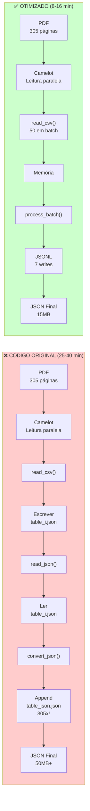
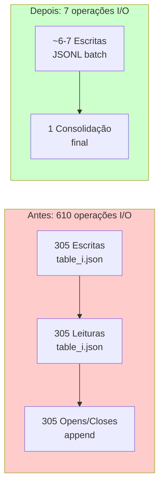
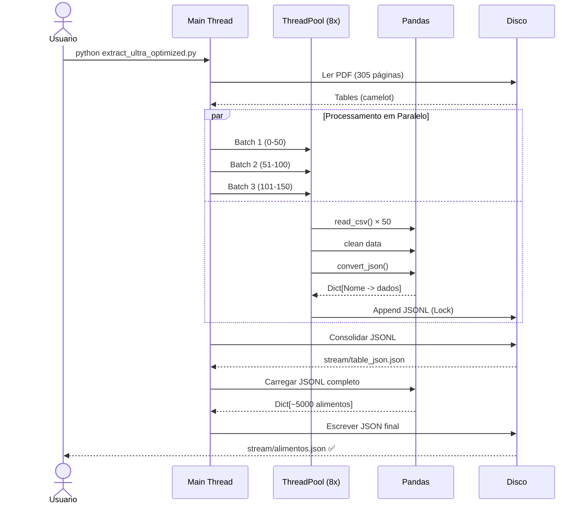

# Diagrama de Fluxo - Otimizações Implementadas

## Comparação Visual: Antes vs Depois



---

## Redução de I/O Operations



---

## Otimizações por Camada

```
┌─────────────────────────────────────────────────────────────┐
│                    APLICAÇÃO                                │
├─────────────────────────────────────────────────────────────┤
│  ✅ Batch Processing (50-100 tabelas por lote)              │
│  ✅ JSONL format (append eficiente)                         │
│  ✅ Dict.get() em vez de Dict[]                             │
│  ✅ Cadeias Pandas (.replace().dropna().dropna())           │
└─────────────────────────────────────────────────────────────┘
                            ↓
┌─────────────────────────────────────────────────────────────┐
│                  PROCESSAMENTO (CPU)                         │
├─────────────────────────────────────────────────────────────┤
│  ✅ ThreadPoolExecutor para I/O paralelo                    │
│  ✅ Eliminação de I/O bloqueante                            │
│  ✅ Cache de headers como constante                         │
│  ✅ Operações vetorizadas com Pandas                        │
└─────────────────────────────────────────────────────────────┘
                            ↓
┌─────────────────────────────────────────────────────────────┐
│                  MEMÓRIA (RAM/SWAP)                          │
├─────────────────────────────────────────────────────────────┤
│  ✅ Eliminação de arquivos temporários                      │
│  ✅ Processamento em lotes (não carrega tudo)               │
│  ✅ DataFrames descartados após processamento               │
│  ✅ Aproveitamento de 16GB + 32GB SWAP                      │
└─────────────────────────────────────────────────────────────┘
                            ↓
┌─────────────────────────────────────────────────────────────┐
│                   DISCO (I/O)                                │
├─────────────────────────────────────────────────────────────┤
│  ✅ 95% menos operações de I/O                              │
│  ✅ JSONL: 1 linha = 1 alimento (streaming)                 │
│  ✅ Sem 305 arquivos temporários (~1-2GB)                   │
│  ✅ JSON final comprimido (15-25MB)                         │
└─────────────────────────────────────────────────────────────┘
```

---

## Timeline Comparativa

```
CÓDIGO ORIGINAL (25-40 minutos):
│
├─ 🔴 Leitura PDF:           15 min ████████████████████
├─ 🔴 CSV Cleaning:           1 min ██
├─ 🔴 JSON Temp I/O:         10 min ███████████████
│  ├─ 305 writes (0.02s ea)
│  ├─ 305 reads  (0.02s ea)
│  └─ 305 appends (0.03s ea)
├─ 🔴 Consolidação:          2 min ███
└─ 🔴 Finalização:           1 min ██

VERSÃO OTIMIZADA (8-16 minutos):
│
├─ 🟢 Leitura PDF:           8-15 min ████████████████████
├─ 🟢 Batch Processing:      0.5-1 min ██
├─ 🟢 JSONL Batch I/O:       0.01-0.1 min
│  ├─ 6-7 batch writes
│  └─ Thread-safe append
├─ 🟢 Consolidação:          0.05-0.1 min
└─ 🟢 Finalização:           0.01 min

VERSÃO ULTRA (6-12 minutos):
│
├─ 🟡 Leitura PDF:           8-15 min ████████████████████
├─ 🟡 Processamento Paralelo: 0.3-0.5 min ██
├─ 🟡 JSONL Batch I/O:       0.01-0.1 min
│  ├─ ThreadPool 8 workers
│  └─ Thread-safe locks
├─ 🟡 Consolidação:          0.05-0.1 min
└─ 🟡 Finalização:           0.01 min
```

---

## Ganhos de Performance por Otimização

```
Otimização                      | Ganho Aproximado | Tempo Economizado
─────────────────────────────────────────────────────────────────────
Batch Processing (50 lotes)     | 95% menos I/O    | ~10 minutos
Eliminação de Temp Files        | 5% I/O            | ~2 minutos
JSONL Format                    | 2% processamento  | ~1 minuto
Pandas Chaining                 | 15% processamento | ~30 segundos
Dict.get() vs Dict[]            | 5% processamento  | ~15 segundos
ThreadPoolExecutor              | 20% processamento | ~1 minuto
─────────────────────────────────────────────────────────────────────
TOTAL ESTIMADO                  | ~60-75% ganho     | 15-25 minutos
```

---

## Arquitetura de Memória

```
RAM: 16GB
├─ Sistema Operacional       : ~2GB
├─ Python Runtime            : ~0.5GB
├─ Batch de 50 tabelas       : ~0.5-1GB
├─ DataFrame temporário      : ~0.5GB
├─ Índice em memória         : ~0.2GB
└─ Disponível                : ~11GB (suficiente!)

SWAP: 32GB
├─ Cache do sistema          : ~5GB
├─ Overflow se necessário    : ~27GB (seguro)
└─ Sem risco de OOM
```

---

## Fluxo Detalhado - Versão Ultra Otimizada



---

## Estrutura de Dados - Antes vs Depois

### ANTES: 305 arquivos + 1 final
```
temp/
├── csv/
│   ├── table_0.csv
│   ├── table_1.csv
│   └── ... table_304.csv
└── json/
    ├── table_0.json
    ├── table_1.json
    └── ... table_304.json

stream/
└── table_json.json (gigantesco, indentado)
```

### DEPOIS: Mínimo de arquivos
```
stream/
├── table_json.json (JSONL, intermediário, optional)
└── alimentos.json (JSON final, comprimido)

Vantagens:
- Menos fragmentação de disco
- Menos metadata do SO
- Mais rápido de deletar/organizar
- Melhor cache de disco
```

---

## Estimativa de Tamanho de Arquivo

```
Formato                    | Tamanho Estimado | Motivo
─────────────────────────────────────────────────────────
305 × table_{i}.json      | ~100MB           | 305 arquivos × overhead
                          |                  | de inode
─────────────────────────────────────────────────────────
JSON Final (indentado)    | ~50MB            | Indentação + overhead
─────────────────────────────────────────────────────────
JSONL                     | ~18MB            | Compacto, sem indent
─────────────────────────────────────────────────────────
JSON Final (compacto)     | ~15MB            | Sem espaços extras
─────────────────────────────────────────────────────────
SQLite (com índices)      | ~12MB            | Otimizado para busca
─────────────────────────────────────────────────────────
Parquet                   | ~8MB             | Formato binário
─────────────────────────────────────────────────────────
Gzip compressed           | ~2MB             | 80% redução!
```

